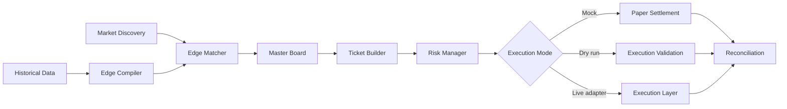

# EdgeRunner

A Python project for statistical edge detection and automated execution in time-sensitive simulated markets.

EdgeRunner combines market discovery, historical edge matching, ticket construction, bankroll controls, and execution logic. The project is structured around a few core ideas: qualify candidate edges, reduce exposure to weak signals, schedule bets based on urgency, and validate execution before live use.

The public version has been decoupled from the original live platform and uses generic configuration and offline fixtures for review and experimentation.

## Architecture



The flow is straightforward: discover candidate markets, compare them against historical edge data, build tickets only from qualified selections, apply existing risk constraints, and then validate or execute the result.

## What the project does

| Area | What it does |
|---|---|
| Discovery | Polls multiple leagues and synchronizes timing |
| Edge matching | Compares current odds with historical edge tables |
| Master board | Combines candidates from different leagues and rounds |
| Ticket builder | Builds singles and multi-leg tickets |
| Risk controls | Limits exposure and aborts under defined loss conditions |
| Execution | Supports mock, dry-run, and browser-driven modes |
| Reconciliation | Matches placed tickets with settlement results |

## Quickstart

### Install dependencies

```bash
git clone https://github.com/Abraham-Babs/edgerunner.git
cd edgerunner
uv sync
```

### Run the offline mock engine

```bash
python -m engine.runner --mock --max-rounds 3
```

This exercises the mathematical pipeline, candidate selection, master-board building, and simulated settlement without requiring credentials or external connectivity.

### Run the dry-fire validation suite

```bash
python test_dry_fire_suite.py
```

This validates the DOM flow, odds selection, betslip state handling, and execution logic without placing real bets.

## Project structure

```text
engine/
├── runner.py                  # Orchestration and execution modes
├── edge_matcher.py            # Qualifies candidate edges from historical tables
├── ticket_builder.py          # Builds tickets and sizes stakes
├── master_board.py            # Aggregates and prioritizes candidates
├── bettor.py                  # Browser/API execution layer and reconciliation
├── parser.py                  # DOM parsing and page sanitization
├── human_interaction.py       # Human-like interaction timing and gestures
├── discovery/
│   └── client.py              # Market discovery and synchronization
├── pipeline/
│   └── edge_compiler.py       # Statistical compilation of confirmed edges
├── tests/
│   └── test_tickets.py        # Ticket-level verification and invariants
├── config.py                  # Profiles, risk limits, and configuration
└── ...

analysis/
├── results/
│   ├── confirmed_edges.csv
│   └── bet_log.csv
└── ...

LICENSE
README.md
sample_odds.json
```

## Important note on model validity

The original strategy eventually lost its edge. I initially suspected ordinary variance, but further inspection showed that the underlying data-generating process had changed and the historical assumptions no longer matched the live environment. The historical edge was not representative anymore.

That is an important lesson in this kind of system: a strong execution framework cannot compensate for a broken assumption in the data or model. It is better to stop a strategy than to keep adjusting around a premise that no longer holds.

This repository is therefore kept as a sanitized engineering demonstration of the system design, the execution logic, and the model-risk lesson rather than as a claim that the original live strategy is still valid.

## Risk controls and validation

The engine includes a few practical safeguards:

- profile-based thresholds for edge and odds bounds
- duplicate-match prevention
- active exposure limits
- stop-loss protection based on bankroll and true equity
- dry-run execution for UI validation without real risk
- settlement reconciliation and bet logging
- recovery after failed submissions or stale page state

## Scope and safety

This public version is intended for review, offline experimentation, and technical discussion. Any live execution path requires explicit authorization, proper environment controls, and independent validation of the underlying assumptions.

## License

This project is licensed under the [MIT License](LICENSE).
